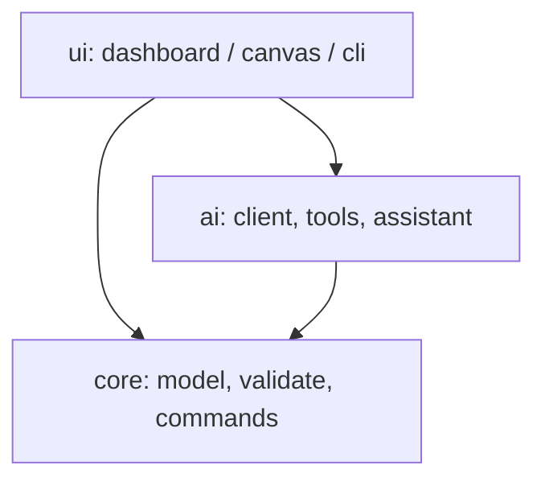

# Netwright

Netwright is a desktop app for drawing network topologies and planning VLANs.
You drop switches, routers, firewalls and hosts on a canvas, wire them together,
assign VLANs and inter-VLAN rules, and it checks the design for the mistakes
that are easy to make by hand: overlapping subnets, VLAN IDs out of range, a
trunk that forgot to allow a VLAN it carries, a gateway that isn't actually
inside its own subnet.

Two things make it more than a diagram tool. There's an optional assistant
(Anthropic's Claude) that takes a request like *"isolate the guest VLAN from
sales and engineering"* and turns it into concrete edits you review before
anything touches the canvas. And if a network already exists, Netwright can
rebuild the map from your devices' LLDP/CDP neighbor tables instead of making
you draw it by hand.

It's written in Python with PyQt5. I built it as a companion to my other
project, [SecureLink](https://github.com/FirasBech) — Netwright exports a
`vlan_policy.json` in the exact format SecureLink's VLAN guard reads.

## Install

```
pip install "PyQt5>=5.15" "anthropic>=0.40" "pytest>=8"
```

`anthropic` is only needed for the assistant; the rest works without it.
Optional extras: `netmiko` for SSH discovery, `pysnmp` for SNMP discovery.

## Running it

Double-click `Netwright.bat` on Windows, or:

```
python -m ui.dashboard      # the GUI
python -m ui.cli --help     # the command line
```

Open `samples/campus.netwright` to poke at a small campus network — it ships
with one deliberate mistake so you can watch validation catch it. Set
`ANTHROPIC_API_KEY` and the assistant panel comes alive; leave it unset and
everything except the assistant still works.

## What's in it

| Area | What it does |
| --- | --- |
| Canvas | Drag-and-drop devices, port-to-port links, undoable moves, snap-to-grid, minimap, fit-to-view, VLAN color overlay |
| VLANs | Create/edit VLANs, subnets, gateways; access and trunk ports |
| Policy | Deny-by-default inter-VLAN ACLs; import and export SecureLink's `vlan_policy.json` |
| Validation | 17 checks (subnet overlap, VLAN range, native/trunk mismatch, dangling links…), click a finding to jump to it |
| Assistant | Plain-English requests become reviewable edits; you approve or reject each op; works offline with a templated explainer |
| Discovery | Rebuild a topology from LLDP/CDP — from pasted text, or live over SSH or SNMP |
| Reachability | Static "can A reach B?" over the VLAN graph and ACL rules |
| Export | Project JSON, SVG/PNG diagram, policy map, Cisco-IOS-style config |
| Themes | Dark, light, high-contrast, remembered between runs |

## How it's laid out

`ui` depends on `core` and `ai`; `ai` depends on `core`; `core` depends on
nothing and never imports Qt. That last rule has a test that fails if it's ever
broken, which keeps the domain logic headless and easy to test.



The assistant never edits the model directly. It proposes a batch of ops;
Netwright re-runs the same validator a human sees, shows a diff, and only
applies the batch — as a single undo step — once you approve it.

## The project file

A `.netwright` file is one UTF-8 JSON document:

```text
{
  "schema":  "netwright.project",
  "version": 2,
  "name":    "Campus",
  "topology": { "devices", "links", "vlans", "subnets", "acls" },
  "view":     { "zoom", "center" }
}
```

VLAN IDs are integers in memory but string keys on disk (JSON keys always are),
and they're coerced back on load. Saves are atomic and keep a `.bak`; the loader
won't overwrite a file it failed to parse, and it refuses files written by a
newer version rather than silently dropping fields.

## VLAN policy

`config/vlan_policy.json` maps a source VLAN to the destinations it may reach.
Anything not listed is denied. It's byte-compatible with SecureLink:

```json
{
  "10": [10, 20],
  "20": [20],
  "30": [10, 30]
}
```

## Discovery

Three ways to get an existing network in without drawing it:

- **Offline** — run `display lldp neighbor` (Huawei) or `show cdp neighbors
  detail` (Cisco), save the output, and import the text.
- **SSH** — hand Netwright an inventory and it runs those commands for you
  (`pip install netmiko`).
- **SNMP** — it walks the LLDP-MIB instead, for when SSH is closed but SNMP read
  is open (`pip install pysnmp`).

Either way it pulls out each neighbor's name, connected ports, model, management
IP and role, and merges the per-device views so a link A and B both report shows
up once. The two live modes are read-only and ask you to confirm you're
authorized before connecting. Run them on networks you manage.

## Tests

```
pytest tests/ -v
```

No network and no API key required — the Claude client and the SSH/SNMP
transports are faked, so the whole suite runs offline.

## What it doesn't do

- It doesn't push config to hardware or scan a network. Discovery reads neighbor
  tables you already have, or fetches them read-only; it never probes.
- The IOS export is a starting template to review, not something to paste into a
  live device unchecked.
- Reachability is static analysis over the VLAN graph and ACL rules — it doesn't
  simulate packets, routing protocols, or spanning tree.
- The assistant can be wrong. The validator, not the model, decides whether a
  design holds up.

It's comfortable with designs of a few dozen nodes.

## License

MIT, © 2026 Firas Bech. Provided as-is, without warranty. Generated configs and
policy files are unverified templates — review them before deploying, and only
use the discovery features on infrastructure you're authorized to manage.
